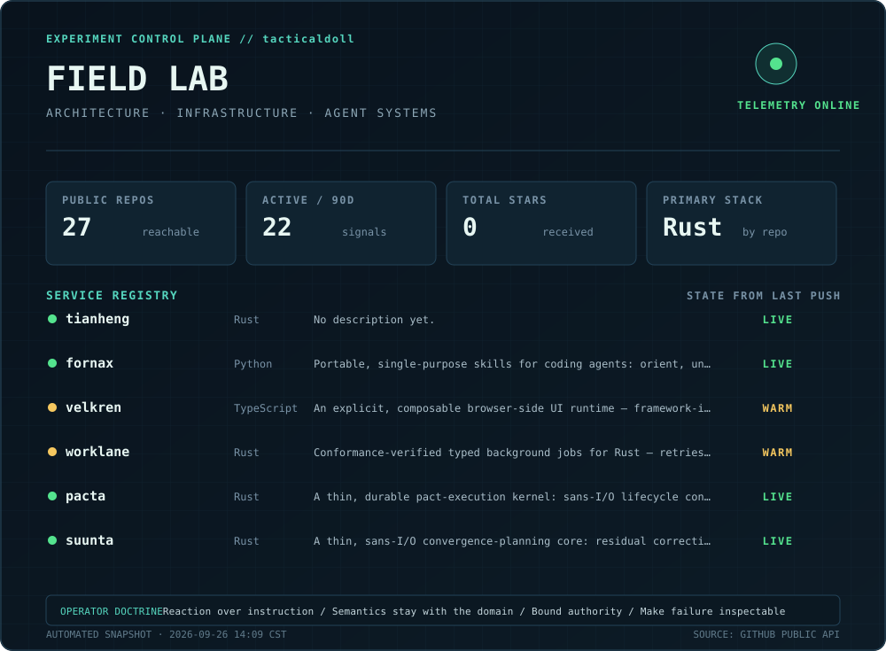

# tacticaldoll / field lab

> 這裡不是自介的副本，而是目前實驗方向的動態索引。關於我是誰與 `TTL:0` 的由來，以網站的 [About](https://tacticaldoll.github.io/about/) 為準。

  

## Current experiment vectors

| Direction | Question under test | Systems |
|---|---|---|
| Reactive architecture governance | 架構能否被宣告成可觀測的結構，並在偏移時由編譯器、CI 或 runtime 立即反應，而不只依賴人記得規則？ | [Tianheng](https://github.com/tacticaldoll/tianheng) |
| Domain-owned durability and convergence | 耐久生命週期與收斂規劃能否維持為精簡核心，把語意判斷、執行組合與外部整合留給使用者的 domain？ | [Pacta](https://github.com/tacticaldoll/pacta) · [Suunta](https://github.com/tacticaldoll/suunta) |
| Conformance-verified job execution | 不同 broker 能否由同一套行為契約驗證 retry、lease、dead-letter 與並行控制，而不是只共享介面？ | [Worklane](https://github.com/tacticaldoll/worklane) |
| Explicit renderer-neutral UI runtime | UI 的 identity、scope、state、event 與 lifecycle 能否由 framework-independent runtime 擁有，讓 React、Solid 等 renderer 只作為投影？ | [Velkren](https://github.com/tacticaldoll/velkren) |
| Bounded agent workflows | Agent skill 能否保持單一職責、跨宿主可攜，並以明確的 read／plan／report 邊界改善推理而不暗中修改？ | [Fornax](https://github.com/tacticaldoll/fornax) |

These are working hypotheses, not permanent categories. The control plane is rebuilt daily from public GitHub data.
